# Pentest VulnerableLightApp

- [Pentest VulnerableLightApp](#pentest-vulnerablelightapp)
  - [Audit via skyk.io](#audit-via-skykio)
    - [Critique 🔴🔴🔴](#critique-)
      - [CWE-798 (Use of Hard-coded Credentials)](#cwe-798-use-of-hard-coded-credentials)
      - [Exposure of Sensitive Information to an Unauthorized Actor (CWE-200)](#exposure-of-sensitive-information-to-an-unauthorized-actor-cwe-200)
      - [zlib/zlib1g (Integer Overflow or Wraparound) (CWE-190)](#zlibzlib1g-integer-overflow-or-wraparound-cwe-190)
      - [Code Injection (CWE-94)](#code-injection-cwe-94)
    - [Criticité - Haute 🔴🔴](#criticité---haute-)
      - [Deserialization of Untrusted Data (CWE-502)](#deserialization-of-untrusted-data-cwe-502)
      - [Server-Side Request Forgery (SSRF) (CWE-918)](#server-side-request-forgery-ssrf-cwe-918)
      - [XML External Entity (XXE) Injection (CWE-611)](#xml-external-entity-xxe-injection-cwe-611)
    - [XML Injection (CWE-91)](#xml-injection-cwe-91)
  - [Exploit of Found Vulnerabilities 🕵️​](#exploit-of-found-vulnerabilities-️)
    - [Recon](#recon)
    - [SQLi (CWE-89)](#sqli-cwe-89)
    - [Path Traversal (CWE-22)](#path-traversal-cwe-22)
    - [Insertion of Sensitive Information into Log File (CWE-532)](#insertion-of-sensitive-information-into-log-file-cwe-532)
    - [XML Injection (CWE-91) + Improper Restriction of XML External Entity Reference (CWE-611) + SSRF (CWE-918)](#xml-injection-cwe-91--improper-restriction-of-xml-external-entity-reference-cwe-611--ssrf-cwe-918)
    - [Use of Hard-coded Credentials (CWE-798) -\> Information Leak + Bad rigth configuration](#use-of-hard-coded-credentials-cwe-798---information-leak--bad-rigth-configuration)
    - [Cross-site Scripting - XSS (CWE-79)](#cross-site-scripting---xss-cwe-79)
    - [Command Injection (CWE-77)](#command-injection-cwe-77)
    - [Server-Side Request Forgery (SSRF) (CWE-918)](#server-side-request-forgery-ssrf-cwe-918-1)
    - [Insecure Direct Object Reference (CWE-639) - Improper Access Control (CWE-284)](#insecure-direct-object-reference-cwe-639---improper-access-control-cwe-284)
    - [Exposure of Sensitive Information to an Unauthorized Actor (CWE-200)](#exposure-of-sensitive-information-to-an-unauthorized-actor-cwe-200-1)
    - [Local File Inclusion (CWE-829)](#local-file-inclusion-cwe-829)
    - [Unrestricted Upload of File with Dangerous Type (CWE-434)](#unrestricted-upload-of-file-with-dangerous-type-cwe-434)
    - [(Integer Overflow or Wraparound) (CWE-190)](#integer-overflow-or-wraparound-cwe-190)
    - [Generation of Incorrect Security Tokens (CWE-1270) + Improper Authentication (CWE-287)](#generation-of-incorrect-security-tokens-cwe-1270--improper-authentication-cwe-287)
    - [GraphQL - Exposure of Sensitive Information to an Unauthorized Actor (CWE-200)](#graphql---exposure-of-sensitive-information-to-an-unauthorized-actor-cwe-200)

## Audit via skyk.io

### Critique 🔴🔴🔴

---

#### CWE-798 (Use of Hard-coded Credentials)

Cette `CWE` fait référence au `TOKEN` etant secret sur l'application, souvent utiliser pour chiffrer les données, est hardcodé (stocké en dur) dans le fichier de configuration, il est donc visible sur dépot git.

#### Exposure of Sensitive Information to an Unauthorized Actor (CWE-200)

De même, exposition de données stocké en dure dans le code : `Model/Model.cs`, en faites il n'y a pas de base de donnée pour cette application, les donnée sont donc stocké dans un model (architecture MVC), les `usernames` et `passwords` sont stocké en claire dans le code au format json, si un attaquant met la main dessus, ce dernier pourrait essayer de bruteforcer les hash, et tenter de retrouver la valeur des chaines de caractere d'origine et ainsi compromettre la sécurité de l'application.

[Code source du Model](https://github.com/User89213/VulnerableLightApp/blob/main/Model/Model.cs)

#### zlib/zlib1g (Integer Overflow or Wraparound) (CWE-190)

Via une entrée utilisateur, un attaquant pourrait controller la zone memoire et pourrait donc executer du code arbitraire.

#### Code Injection (CWE-94)

Cette vulnerabilité permet d'injecter des commande système via un parametre dans l'url. Cette vulnerabilité est marqué avec une criticité `Haute` par `Snyk`, or dans l'application cette derniere donne un accès à la machine avec des droits `root`. Je me permet de la passer en critique.

### Criticité - Haute 🔴🔴

> Les endpoints ont été trouvé via fuzzing pour la pluspart des cas et le pentest, pour ceux non trouvé le pentest à été réalisé en whitebox.

---

#### Deserialization of Untrusted Data (CWE-502)

La deserialisation mal nettoyer peut mener à des failles de sécurité tel que des prototypes pollution, c'est le cas dans cette application, un attaquant pourrait mener à de l'injection de code arbitraire.

#### Server-Side Request Forgery (SSRF) (CWE-918)

Cette vulnerabilité permet à un attaquand de manipulé un parametre dans le but de faire des requetes sur un service internet pour pouvoir recuperer des ressources qui pourrait etre restreinte seulement via un accès interne à la machine (IP: `127.0.0.1` par exemple).

#### XML External Entity (XXE) Injection (CWE-611)

Dans le cadre d'une application en `C#`, cela conduit à de l'injection XML dans l'application et peu mener à du Path Traversale à leak d'information.

### XML Injection (CWE-91)

De même, elle mène à de l'injection de XML dans l'applciation du à un mauvais parssing et sanitization des données.

Dans le cadre d'une application qui reposerait sur les données XML envoyé via l'url pour "résoudre" des conditions ou autres, un payloads pourrait etre passer pour usurper un username `admin` par exemple.

## Exploit of Found Vulnerabilities 🕵️​

### Recon

En amont du pentest, beaucoup de Route ont été trouvé via des methodes de fuzzing à l'aide de `ffuf` et de la `seclists` pour la plus part des Endpoints de l'`API`.

Un des gros points d'entrée est le `/swagger` qui nous permet de découvrir la plupart des routes de l'application.

### SQLi (CWE-89)

Sur la route `/Login`, une SQLi est realisable, cette dernière retourne un token de connexion au format `JWT`, nous forgerons ce dernier dans nos `URL` par la suite dans le but de pouvoir accèder aux atres ressources de l'applciation.

Pour patcher la vulnerabilité, les caractères doivent être échappé, ne doivent pas être passé dans la string qui envoyé la requete SQL mais doivent etre préparé avant envoyé de la requête.

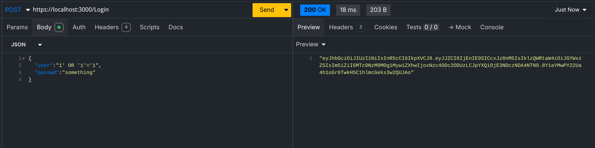

### Path Traversal (CWE-22)

Via le parametre `?lang=` nous sommes en capacité de choisir une lang, or la logique repose sur un fichier au fromat json qui affichera les données, un filtre de piètre qualité à été mis en place pour empêcher un debutant de réaliser ce genre d'attaque or elle est réalisable, il suffit de contourner les filtres `..\` `../` qui remplace la string par `<empty>` si detecté par `/` or `....//`.

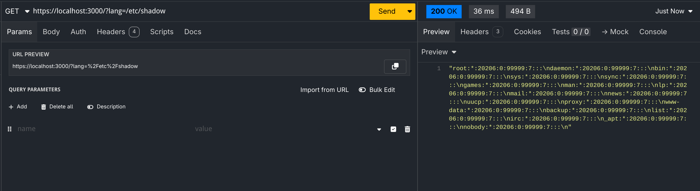

Cette vulnerabilité nous mène donc à du leak d'information Pour être eviter il faut mettre en place un white liste de fichier autorisé.

### Insertion of Sensitive Information into Log File (CWE-532)

Cette vulnerabilité mène à du leak d'information, dans cette application lors d'une request de conenxion les parametre de la request dans le cas ou lon recupere le fichier nommé `Logs.html`, ce dernier increment les logs en ajoutant les valeur des parametres `user` et `passwd`.

### XML Injection (CWE-91) + Improper Restriction of XML External Entity Reference (CWE-611) + SSRF (CWE-918)

Dans le cadre d'une application qui reposerait sur les données XML envoyé via l'url pour "résoudre" des conditions ou autres, un payloads pourrait etre passer pour usurper un username `admin` par exemple.

Pour la XXE, cette dernière mène à de l'inclusion de fichier via des attaques de Path Traversale ou ensore à des `SSRF`.

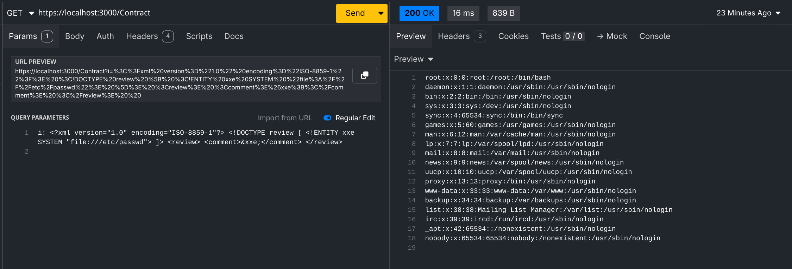

### Use of Hard-coded Credentials (CWE-798) -> Information Leak + Bad rigth configuration

Apres exploitation du Path Traversale le fichier `/etc/shadow` est accessible, le server web est lancé en tant que root.

Et le code source de l'application à pu leak et cela nous permet de découvrir le code source des fichiers et d'exploiter d'autres vulnerabilité.


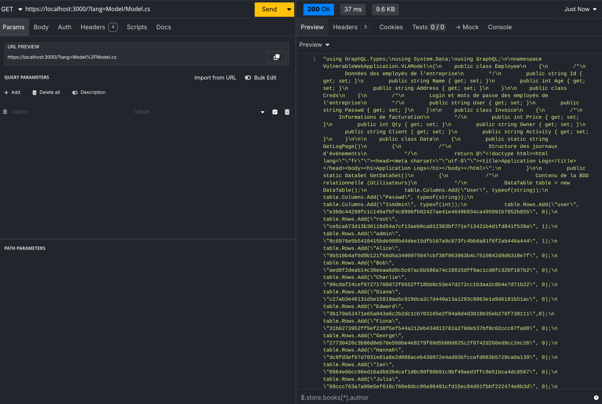

On casse le hash avec hashcat.

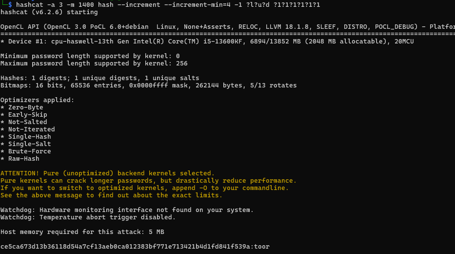

On forge la request.

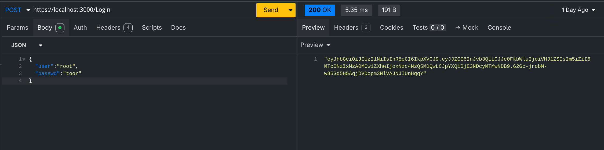

Et on obtient un token en root. Bonjour la sécurité...

Les mots de passe faible ne doivent pas être utilisé, et un algorithme de hashage dédié au password de la famille des `blobfish` ou `argon2i` doivent etre utilisé pour éviter les attaques par rainbow tables et rendre chaques hash unique pour une même valeur d'entrée.

### Cross-site Scripting - XSS (CWE-79)

Sur la page d'erreur 404, le parametre URI request est passé dans la templates qui retourne l'erreur 404 pour indiqué le nom de la ressource not found, cela laisse place à une XSS.

Des filtre sont en place avec des verifications sur la chaine de racateres pour savoir si cette dernière contient le keyword `script`, cela peut etre bypass tres facilement via un element du DOM qui permet l'inclusion de script via des `attr`.


Pour patcher la vuln, les caracteres doivent etre echappé et pour les caracteres speciaux convertis en `encodage HTML` avant d'etre renvoyé à l'utilisateur.

### Command Injection (CWE-77)

Via la route `LocalDNSResolver`, une vuln de command injection est réalisable, de plus les commandes sont executé en root.

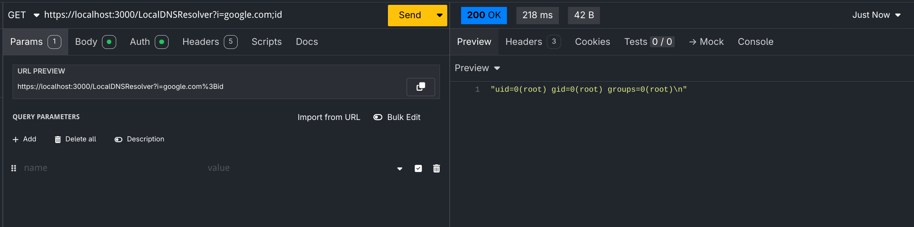

J'ai reussi tres facilement à executer des request wget, j'ai testé quelque payload pour revshell mais en vain.

Mais cela aurait pu etre fait en créant un fichier et en l'appelant via l'application.

Pour eviter cette vuln d'avantage de filtre doiven,t etre mis en place tel que: validation via `regex` et une `white liste` de `DNS` ou `keyword`.

### Server-Side Request Forgery (SSRF) (CWE-918)

Malgré les protection de filtre mise en place des attaques SSRF sont réalisable via contournement de filtre.

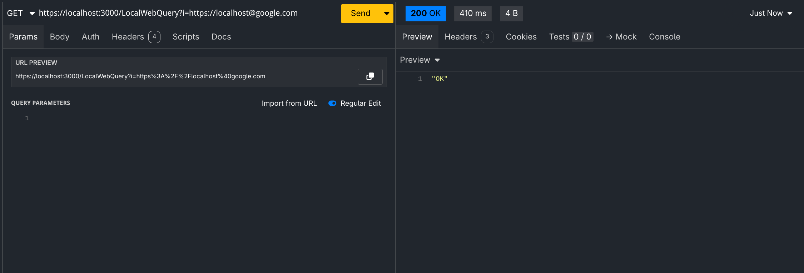

Pour eviter cette vuln d'avantage de filtre doiven,t etre mis en place tel que: validation via `regex` et une `white liste` de domaine autorisé.

### Insecure Direct Object Reference (CWE-639) - Improper Access Control (CWE-284)

Sur la route `/Employee`, via le parametre GET `?i=` une vulnerabilité d'alteration de parametre (`IDOR`) est réalisable, cette dernière expose les données des utilisateurs de l'application.

Pour éviter celle vuln, le programme doit ajouter des conditions pour verifier si l'utilisateur à le droit ou non d'accéder aux données de l'id passé en parametre.

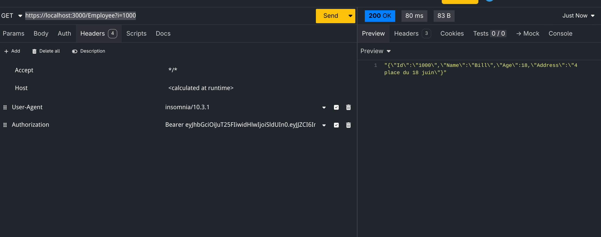

### Exposure of Sensitive Information to an Unauthorized Actor (CWE-200)

Cette vulenrabilité peut etre retrouvé à plusieurs endroit, notamement via `IDOR`, `Path Traversal` (`?lang=`) avec le leak d'informations des fichiers, `SQLi`

### Local File Inclusion (CWE-829)

Cette vulnerabilité est rendu possible car nous une RCE est présente sur l'application, cela permet donc de créer et modifier des fichiers, nous pouvons donc effectuer des `LFI`.

### Unrestricted Upload of File with Dangerous Type (CWE-434)

Puisque nous savons grace au `/swagger` que la route `/Patch` nous permet d'upload des fichier et d'ajouter le header `X-Forwarded-For` nous pouvons essayer d'upload un fichier avec une extension differente de `.svg`. Ayant accès au code source via notre RCE nous pouvons savoir que le Header doit contenir l'ip `10.10.10.256` pour accepter des fichier, de plus il nous faudra un `TOKEN_BEARER` qui nous donnera des droits root.

Essayons d'upload un fichier avec l'extension `.cs` :

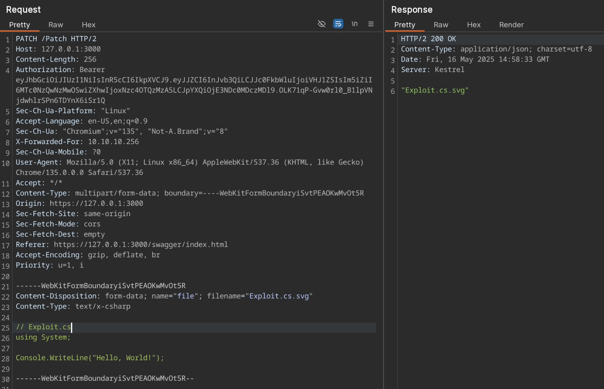

Cela fonctionne aussi avec `.cs%00.svg` ou `.cs .svg`. Il serait possible de rename le fichier via notre RCE, voir de pouvoir retirer l'extension `.svg`.

Pour patcher cette vulnerabilité le code devrait filtrer l'extension + la taille du fichier + le binaire du fichier + le content-type et les valeurs hexa du debut du fichier pour etre sur que le fichier est bien au format `svg`.

### (Integer Overflow or Wraparound) (CWE-190)

Sur l'endpoint nous permettant de calculer la des `TVA`, il est possible de realiser un integer overflow. La fonction appelé fonctionne en 32 bit et aucun controle de verification n'est mis en place sur la valeur du param `price`, ce qui pose soucis si la valeur est trop grande.

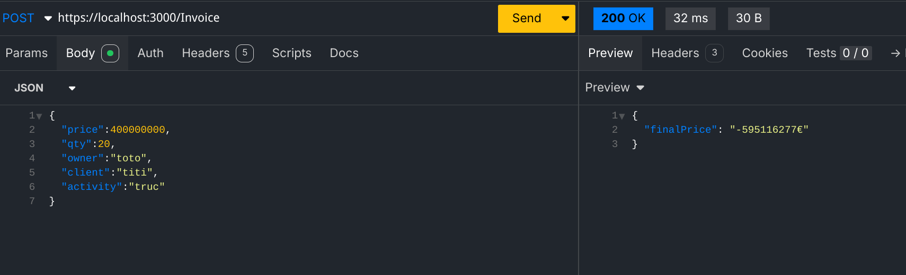

Dans un première temps la valeur renvoyé est négative (**overflow silencieux**). Voyons voir avec si on ajoute un `0` de plus à notre parametre `price` :

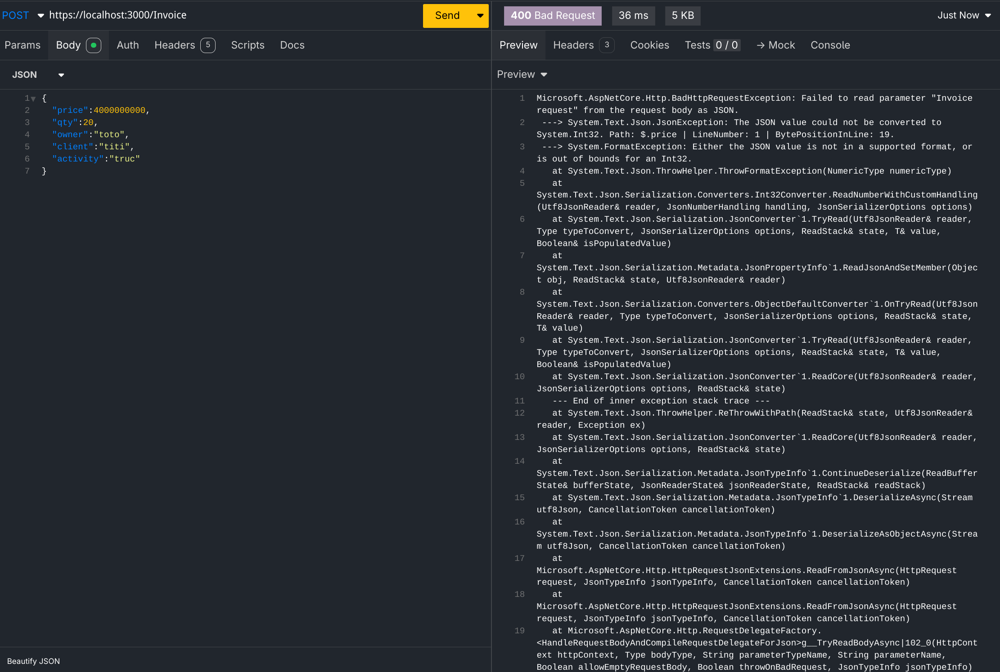

On obtient un overflow detecté par le compilateur `C#`, qui renvoie une erreur.

EN 32 bit, `C#` à les plages suivantes :

```text
Min : -2,147,483,648
Max :  2,147,483,647
```

Si c'est valeur sont dépasser cela laisse place à un `overflow` qui nous permettrais avec un payload minutieux d'injecter du code `Assembly` et d'avoir un accès total à la machine.

Les valeurs doivent être controllé par des conditions pour éviter ce genre d'erreur.

### Generation of Incorrect Security Tokens (CWE-1270) + Improper Authentication (CWE-287)

Via JWT_tool, nous pouvons forger un `JWT` signé avec un algo `none`, le jwt est donc verifié sans signature, élévation de privilege en admin possible via parametre `{"IsAdmin": True}`.

```bash
jwt_tool.py $(cat jwt.txt) -X a
```

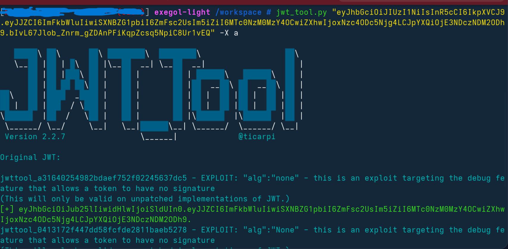
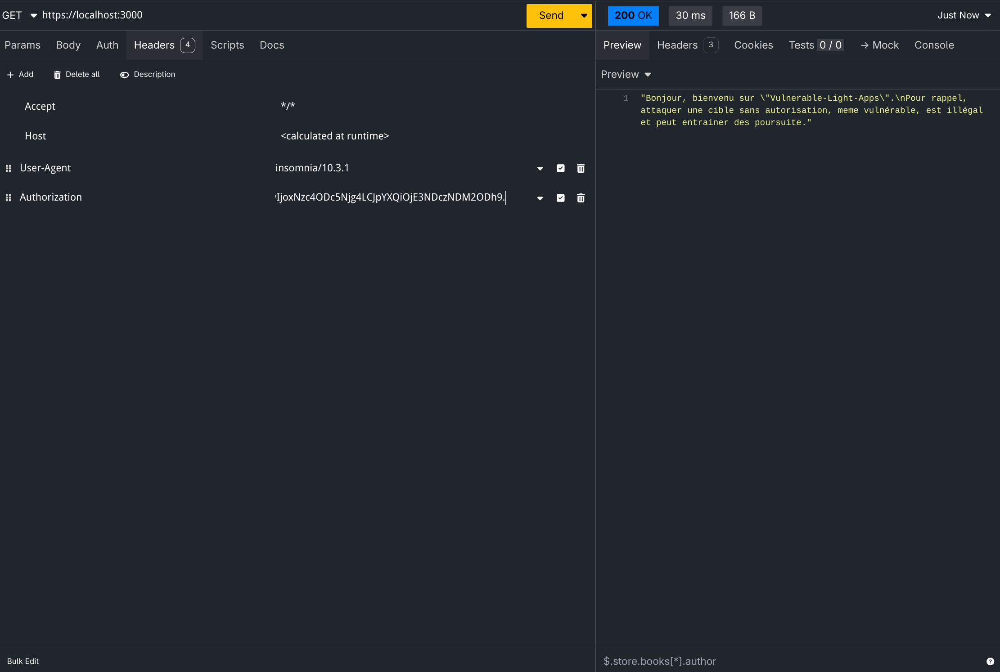

Pour eviter ce genre de vuln, si des librairies sont utilisés, elles doivent être maintenu à jour;

Sinon le programme doit verifier que les headers soient bien valide et ensuite verifier la généré la vrai signature du `JWT` avec les valeurs du header et du payload signé et la comparer à celle envoyé par l'utilisateur pour voir si elle n'a pas été altéré.

### GraphQL - Exposure of Sensitive Information to an Unauthorized Actor (CWE-200)

Un `Endpoint` `/Client` non présent dans le swagger peut etre decouvert en parcourant les fichiers ou via du fuzzing, ce dernier permet d'introspecter la base `GraphQL` et de récuperer des informations bancaire sur des utilisateurs de l'application :

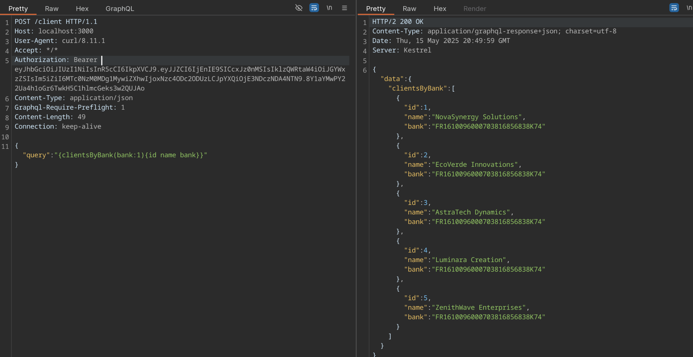

D'avantages de regex ou filtres doivent etre mis en place pour patcher cette vuln.
